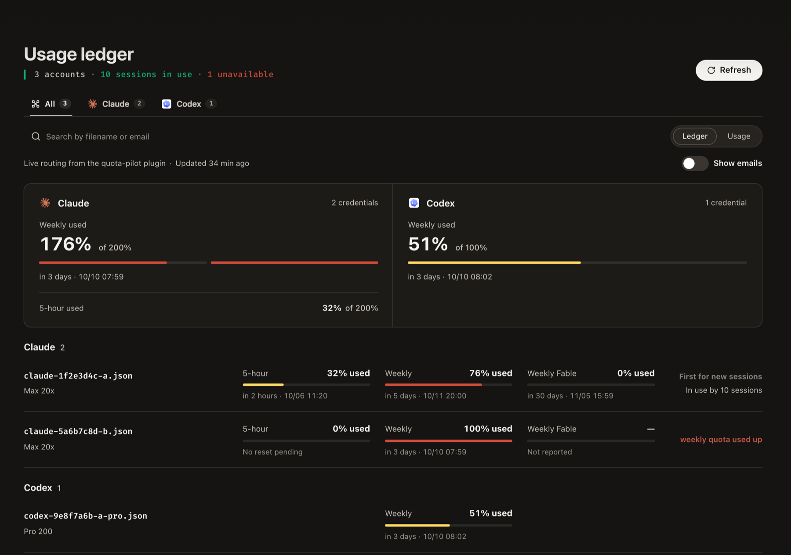

<p align="center">
  
</p>

<h1 align="center">cliproxy-kit</h1>

<p align="center">
  <b>Every Claude Code session on the right subscription account,<br>and a clear view of where the quota went.</b>
</p>

<p align="center">
  <a href="https://github.com/kuan0808/cliproxy-kit/actions/workflows/ci.yml"></a>
  <a href="https://github.com/kuan0808/cliproxy-kit/releases/latest"></a>
  <a href="LICENSE"></a>
  
</p>

<p align="center">
  <a href="#quick-start">Quick start</a> ·
  <a href="#use">Use</a> ·
  <a href="#configuration">Configuration</a> ·
  <a href="#troubleshooting">Troubleshooting</a> ·
  <a href="docs/architecture.md">How it works</a>
  <br>
  English · <a href="README.zh-TW.md">繁體中文</a>
</p>

<p align="center">
  
</p>

For people who run Claude Code and Codex on several subscription accounts through
[CLIProxyAPI](https://github.com/router-for-me/CLIProxyAPI): a proxy plugin (**quota-pilot**) with a
page in the management panel, and a band in Claude Code (**quota-band**).

- 🧭 **The right account for each session.** A new session gets the account whose weekly quota resets
  soonest, so quota that would expire unused goes first; then it stays there and keeps its prompt
  cache. Codex sessions and reviews too.
- 📊 **Where the quota went.** A page in the management panel splits each account's 5-hour window,
  week, or last 7 or 30 days by project and session.
- 🎛️ **The quota where you work.** A band above the Claude Code prompt, in the terminal and the
  desktop app, shows the account, its use, the context and the prompt cache, with one-press
  switching.
- 🧊 **No surprise cold turns.** Before a turn rewrites the prompt cache (it expired, or the session
  moved to another account or model) the band says how much and what that costs at API prices,
  holds a long message until you confirm, keeps the cache warm while you are away, and hands off to
  a fresh session that starts from a summary.
- 🔀 **A handover between providers.** When every Claude account is used up, a session moves to a
  Codex model by hand, or by itself if you turn that on.

<table>
  <tr>
    <td width="50%"><b>Usage</b>: each account's week, by project and day</td>
    <td width="50%"><b>Ledger</b>: every account in routing order</td>
  </tr>
  <tr>
    <td></td>
    <td></td>
  </tr>
</table>

> [!NOTE]
> **Preview.** Settings and data files may change before 1.0. Claude and Codex accounts are
> supported; other providers keep CLIProxyAPI's own routing.

## Quick start

You need [CLIProxyAPI](https://github.com/router-for-me/CLIProxyAPI) 8.0.14+ on macOS or Linux with
your accounts logged in, and [Claude Code](https://code.claude.com) 2.1.287+.

**1. Install quota-pilot.** Turn plugins on and add this store in CLIProxyAPI's `config.yaml`:

```yaml
plugins:
  enabled: true
  store-sources:
    - "https://raw.githubusercontent.com/kuan0808/cliproxy-kit/main/registry.json"
```

Then open the management panel's **Plugin Store**, install **Quota Pilot** and refresh the panel:
its page is under **Plugins**.

<details>
<summary>Install by hand, or from source</summary>

- **By hand:** put the library from the [release](https://github.com/kuan0808/cliproxy-kit/releases/latest)
  zip for your system (`darwin_arm64` for Apple silicon, `linux_amd64` for most servers) in
  CLIProxyAPI's plugin folder (`plugins.dir`), set `plugins.configs.quota-pilot.enabled: true` and
  restart CLIProxyAPI.
- **From source** (Go 1.26, Bun, a C compiler): `scripts/install-plugin.sh` builds, tests and installs
  it, restarts the proxy when Homebrew or systemd runs it, and checks the proxy runs this build. For
  another setup, say where and how:
  `CPA_PLUGINS_DIR=/path/to/plugins CPA_RESTART_CMD="docker restart cliproxyapi" scripts/install-plugin.sh`.

</details>

**2. Install the band.** In Claude Code:

```
/plugin marketplace add kuan0808/cliproxy-kit
/plugin install quota-band@cliproxy-kit
/reload-plugins
```

<details>
<summary>Or ask Claude, use the terminal, or run it from a clone</summary>

- **Ask Claude:** "Install the quota-band plugin from the kuan0808/cliproxy-kit marketplace, then
  reload plugins."
- **Terminal:** `claude plugin marketplace add kuan0808/cliproxy-kit && claude plugin install quota-band@cliproxy-kit`
- **From a clone:** `claude --plugin-dir ./cliproxy-kit/mod`, or list that folder in
  `CLAUDE_CODE_PLUGIN_DIRS` under `env` in `~/.claude/settings.json`.

</details>

The band works without the proxy too, in the desktop app or with a plain claude.ai login: see
[what each part does alone](#with-and-without-the-band).

**3. Connect Claude Code to the proxy.** On the machine where you run it:

```sh
bash <(curl -fsSL https://raw.githubusercontent.com/kuan0808/cliproxy-kit/main/scripts/connect-claude-code.sh)
```

It asks for one of the proxy's client keys, checks the proxy accepts it, points Claude Code at the
proxy and installs the band if it is not there yet. Start a new session: the band shows the
account the proxy gave it.

<details>
<summary>What it changes, to do it by hand</summary>

In `~/.claude/settings.json` (the old file is kept beside it as `settings.json.bak-<time>`), under
`env`:

```json
"ANTHROPIC_BASE_URL": "http://127.0.0.1:8317",
"ANTHROPIC_AUTH_TOKEN": "<a client key of the proxy>",
"CLAUDE_CODE_PROMPT_CACHE_TTL": "1h",
"ENABLE_TOOL_SEARCH": "true",
"ENABLE_CLAUDEAI_MCP_SERVERS": "false"
```

A 1-hour cache keeps long sessions cheap, tool search keeps the prompt small through a proxy, and
claude.ai connectors do not work through one.

</details>

**4. Send Codex through the proxy** (optional). quota-pilot sees only what goes through the proxy:
set Codex up as CLIProxyAPI's [Codex guide](https://help.router-for.me/agent-client/codex) describes.

<details>
<summary><code>~/.codex/config.toml</code></summary>

```toml
model_provider = "cliproxyapi"

[model_providers.cliproxyapi]
name = "OpenAI"
base_url = "http://127.0.0.1:8317/v1"
model_catalog_url = "http://127.0.0.1:8317/v1/models"   # needed from Codex 0.156
experimental_bearer_token = "<a client key of the proxy>"
wire_api = "responses"
requires_openai_auth = true
supports_websockets = true

[features]
api_key_model_discovery = true   # needed from Codex 0.156
```

Without the two lines Codex 0.156 and later cannot read the models' details, and send far larger
requests.

</details>

**5. Show the quota in Codex** (optional). Codex has no status line of its own to fill, and through
a proxy its footer shows no limits; two hooks print a line instead: the account and its use when a
session starts, and after a turn only when the session moved to another account, or its account
passed 80% or ran out.

<details>
<summary>Add to <code>~/.codex/config.toml</code>, with the same key and address</summary>

```toml
[[hooks.SessionStart]]
[[hooks.SessionStart.hooks]]
type = "command"
command = '''id=$(sed -n 's/.*[{,]"session_id":"\([^"]*\)".*/\1/p'); printf 'Authorization: Bearer %s\nX-Codex-Session: %s\n' '<a client key of the proxy>' "$id" | curl -fs -m 3 -H @- "http://127.0.0.1:8317/v0/resource/plugins/quota-pilot/codex?event=SessionStart"'''

[[hooks.Stop]]
[[hooks.Stop.hooks]]
type = "command"
command = '''id=$(sed -n 's/.*[{,]"session_id":"\([^"]*\)".*/\1/p'); printf 'Authorization: Bearer %s\nX-Codex-Session: %s\n' '<a client key of the proxy>' "$id" | curl -fs -m 3 -H @- "http://127.0.0.1:8317/v0/resource/plugins/quota-pilot/codex?event=Stop"'''
```

It needs only `curl`, and Codex asks once to trust the two hooks. Codex shows each line as a notice;
none of it reaches the model.

</details>

### Where the proxy runs

Every part talks to the proxy's address and nothing else, so the proxy can run beside Claude Code,
in a container, or on a server that runs no client at all.

| Setup | What changes |
| --- | --- |
| **The same machine** | Nothing: steps 1 to 5 as above. |
| **Docker** | Keep the proxy user's `~/.cache/cliproxy-kit/` on a volume (`/root/.cache/cliproxy-kit` in most images), or a restart loses the log and the state. |
| **Another machine** | Reach the proxy over an encrypted address, such as one from [Tailscale Serve](https://tailscale.com/kb/1312/serve), and give that address to the connect command and to Codex. |

```sh
bash <(curl -fsSL https://raw.githubusercontent.com/kuan0808/cliproxy-kit/main/scripts/connect-claude-code.sh) https://proxy.example.ts.net:8317
```

- **Devices.** With a reverse proxy such as Tailscale Serve in front, which tells the proxy where a
  request came from, sessions from other devices show on the page under the device's name
  (MagicDNS), else as "Other device". A client that reaches the port directly is not told apart.
- **Names.** The proxy reads Claude Code's transcripts only beside them, as the same user. Elsewhere
  the band names each session; without it a session keeps the title of its first request.
- **Plain http.** The script refuses an `http://` address on another machine; set `ALLOW_HTTP=1`
  when the network already encrypts it (a VPN).

### With and without the band

quota-pilot works on its own; the band adds what only Claude Code can show or do, and works on its
own too.

| | quota-pilot alone | with the band | the band alone² |
| --- | :---: | :---: | :---: |
| An account for each session, kept with its prompt cache | ✅ | ✅ | |
| The usage page: accounts, projects, sessions | ✅ | ✅ | |
| A session's name on the usage page | its first message¹ | Claude Code's title, renames included, from any device | |
| One project per repository across devices | by folder | ✅ | |
| Account, quota, context and cache above the prompt | | ✅ | the signed-in account's own quota |
| Switch an account or a provider by hand | | ✅ | |
| A warning before a cold turn, with its cost; keeping the cache warm; handoff | | ✅ | ✅ |

¹ Claude Code's title too when the proxy runs beside Claude Code, as the same user.

² The desktop app, or Claude Code signed in to claude.ai without the proxy.

The desktop app signs its sessions in to Claude itself, so they never go through the proxy: they get
no account from it, are not on the usage page, and cannot be switched. When the app is signed in to
an account the proxy also holds, its use still lowers that account's quota, and the usage page
counts it as "Not matched to a request".

The band reads the quota with the key Claude Code already sends, once the proxy has served a request
with that key in the last week. So right after installing, and after a week away, it shows the quota
from the first reply on.

## Use

### In Claude Code

Cards while Claude waits, one line while it works:

| On the band | Means |
| --- | --- |
| **Account** | The account the proxy gave this session (`expected` before its first request), its plan and the model. |
| **5-hour**, **Weekly** | That account's use of each window, and when it resets. |
| **Context** | How full the conversation is. |
| **Cache** | Time left before the prompt cache goes cold, `kept warm 1/3` once the band refreshed it; once cold, what the next turn rewrites and costs. |
| **Accounts** | Every account's weekly use, and the one a switch or a new session gets next. |
| **The row above** | One thing at a time: a question for you, what came of an action, or a warning (the proxy, a cold next turn, a session moved, a context filling up). |

| Control | What it does |
| --- | --- |
| `switch` | Moves this session to another account, or to another provider's model and back. While the cache is warm it first says what the move costs, and can hand off first. |
| `hand off` | In the row when the context passes 60%, the next turn would start cold, or a move would. Claude writes a note (goal, done, not done, changes, watch out, next step), the conversation clears, and a new one starts from it. `/handoff [message]` does it any time, with the message after the note. |
| `quota` | Every account's windows; `/quota` opens the same. |
| `more` / `less` | Cards or one line, until the turn changes. |

**Before a cold turn.** When the next turn would rewrite more than 100k tokens of cache, a message
you send waits in the prompt and the row asks: **Enter** again sends it, or hand off with it. While
you are away the band refreshes the cache up to three times, each shortly before it would expire, at
the cache-read price.

In the desktop app the band draws cards in the app's own light or dark theme, with that account's
own quota (see [without the proxy](#with-and-without-the-band)).

### In the management panel

Open **quota-pilot** under **Plugins**. The page uses the panel's login when "remember password" is
ticked, else it asks for the management key once per tab.

- **Ledger:** every account in the order new sessions get them, each window, and what limits it.
- **Usage:** each account's 5-hour window, week, or 7 or 30 days, by project and session, with tokens
  and the cache hit rate. Days follow your time zone.
- **Refresh:** reads every account's quota now, and names any it could not read and why.


### Good to know

- **A window that starts over** before its reset, as after a plan change, counts from then; the use
  before stays in the 7- and 30-day views.
- **Fast modes:** Codex's Fast (`service_tier = "fast"`) uses included limits 2.5 times as fast, and
  counts so. Claude Code's `/fast` is billed to usage credits, not plan limits, so it counts for
  nothing; through a proxy Claude Code offers it only with `CLAUDE_CODE_SKIP_FAST_MODE_ORG_CHECK=1`.
- **Several Codex accounts** take sessions the way Claude accounts do; moving to another provider is
  for Claude Code sessions only.

## Configuration

On the panel's **Plugins** page, or under `plugins.configs.quota-pilot` in `config.yaml`:

| Key | Default | What it does |
| --- | --- | --- |
| `min_five_hour_left_percent` | `25` | A new session is not given an account with less of its 5-hour window left, unless that window resets within 30 minutes. |
| `cross_provider` | `off` | `auto` moves Claude Code sessions to the `fallback_map` model when every account of their provider is used up; `off` leaves that to `switch`. |
| `fallback_map` | none | The model each provider moves to, as `provider: provider:model`, for example `claude: codex:gpt-6.1-sol`. |
| `idle_poll_minutes` | `10` | How often idle accounts' quota is read. |
| `context_lengths` | built in | Context window per model, to tell whether a conversation fits another model. |

The band's settings are in Claude Code's `/config`, and asked for when it is installed:

| Setting | Default | What it does |
| --- | --- | --- |
| Suggest a handoff at | `60` | Context used, in percent, at which the row suggests a handoff. `0` never suggests it. |
| Ask before a cold turn above | `100000` | Conversation size, in tokens, from which a message into a cold turn waits for you. `0` never holds one. |
| Keep the cache warm | `3` | Refreshes of the cache while you are away. `0` turns it off. |

Costs are Anthropic's and OpenAI's API list prices, for comparison: a subscription is not billed per
token. A model without a known price shows tokens only.

## What it changes

| Where | What | To undo |
| --- | --- | --- |
| CLIProxyAPI's `config.yaml` | `plugins:` turned on, the store, and quota-pilot's settings | Remove them. |
| `~/.cache/cliproxy-kit/` of the proxy's user | State, the request log and what is known of each session (mode 0600; client keys as hashes only) | Delete the folder. |
| `~/.claude/settings.json`, on each machine with Claude Code | The `env` keys of step 3; the file as it was is kept as `settings.json.bak-<time>` | Put the backup back. |
| Claude Code's plugins | The `cliproxy-kit` marketplace and `quota-band` | `claude plugin uninstall quota-band@cliproxy-kit` |
| `~/.cache/cliproxy-kit/handoff/`, beside the band | The notes handoffs wrote | Delete the folder. |
| `~/.codex/config.toml` (optional) | The model provider of step 4 and the hooks of step 5 | Remove them. |

## Update and uninstall

- **Update:** the panel's Plugin Store offers new versions of quota-pilot. The band updates with
  `claude plugin update quota-band@cliproxy-kit`, or by itself once auto-update is on for the
  marketplace under **Marketplaces** in `/plugin`; `/reload-plugins` loads it in a running session.
  Update both: they change together.
- **From 0.1.6:** the band reads everything over the network, with the key Claude Code already
  uses, so `band_tokens` is no longer read: remove it from `config.yaml`. Sessions, projects and
  remembered folders move into `usage/sessions.json` by themselves.
- **Uninstall:** delete Quota Pilot on the panel's **Plugins** page,
  `claude plugin uninstall quota-band@cliproxy-kit` removes the band, then undo the rest as the
  table above says.

## Troubleshooting

| You see | Do this |
| --- | --- |
| The store install fails | The panel waits 30 seconds for the 2 MB download from GitHub: install by hand (step 1). |
| The band in the desktop app shows no quota yet | The app's session reports its limits with its first reply. |
| No quota-pilot page under Plugins | Refresh the panel, and check `plugins.enabled: true`. |
| The band says quota data comes once this key has sent a request | Send one prompt: the proxy has not accepted that key for a request in the last week. |
| The band says quota data is old | The proxy, or the plugin in it, stopped: restart CLIProxyAPI. |
| Codex sessions are missing from the page | Codex does not use the proxy yet (step 4). |
| Codex says a hook exited with code 7 or 22 | No proxy answers at the hook's address (7), or quota-pilot is not on it (22). |
| A Codex account has no 5-hour window | Its plan has none; the page and the band say so. |

## Privacy and security

- **One owner.** Every client key of the proxy is trusted. Once the proxy has accepted a key for a
  request, it reads every account's quota (masked labels, no emails or paths), and names and
  switches the sessions it started. Give keys only to people you would show your usage to; a key
  removed from the proxy keeps reading for up to a week.
- **Local.** Everything stays in `~/.cache/cliproxy-kit/` (mode 0600) of the proxy's user, client
  keys only as hashes. Besides the requests it routes, the plugin calls only the providers' own
  usage and profile endpoints, with the accounts' existing tokens, and DNS for device names.
- **Transcripts.** It reads Claude Code's transcripts only on its own machine, as its own user.
- **Behind keys.** The page carries no data: it reads everything through management routes, behind
  the management key. The band's and the Codex hooks' routes need a client key the proxy accepted.

## Develop

```sh
cd plugin && go test ./...                                   # the plugin
cd ui && bun install && bun run verify                       # the page: tests, lint, types, build
cd mod && claude plugin test . && claude plugin validate .   # the band
```

`scripts/install-plugin.sh` installs a local build. `git config core.hooksPath scripts/git-hooks`
turns on a pre-commit check for credentials (PyYAML; Python 3.11+ to read Codex's config). A
`v<version>` tag publishes the release the store installs, and must match
`mod/.claude-plugin/plugin.json`. How the parts decide and what they store:
[docs/architecture.md](docs/architecture.md).

## License

[MIT](LICENSE). The page reuses styles and components of the CLIProxyAPI management panel, under its
MIT licence ([ui/LICENSE.panel](ui/LICENSE.panel)).

Not affiliated with Anthropic, OpenAI or the CLIProxyAPI project. Using subscription accounts through
a proxy may conflict with a provider's terms; check them first, and use this at your own risk.
