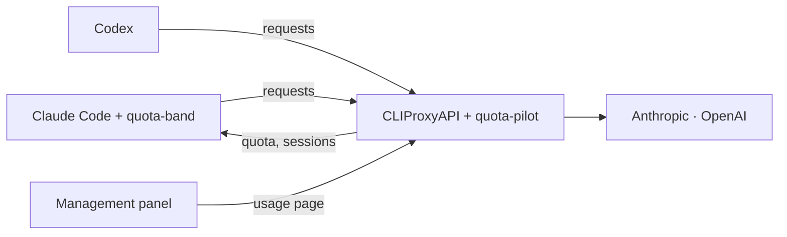

<p align="center">
  
</p>

<h1 align="center">cliproxy-kit</h1>

<p align="center">English | <a href="README.zh-TW.md">繁體中文</a></p>

<p align="center">
  <a href="https://github.com/kuan0808/cliproxy-kit/actions/workflows/ci.yml"></a>
  <a href="LICENSE"></a>
  
</p>

<p align="center">
  Quota-aware account routing for <a href="https://github.com/router-for-me/CLIProxyAPI">CLIProxyAPI</a>,<br>
  with a usage page in its management panel and a quota band in Claude Code.
</p>


> **Preview.** Versions before 1.0 may change their settings and data files. Claude and Codex
> accounts are supported; other providers are left to CLIProxyAPI's own routing.

## What it does

- **Puts each session on the right account.** A new Claude Code session gets the account whose weekly
  quota resets soonest, among those with enough of their 5-hour window left, so quota that would
  expire unused goes first. A session then stays on its account and keeps its prompt cache; after an
  hour idle, when its cache is gone anyway, it moves off an account that is running low.
- **Shows where the quota went.** A page in the management panel splits every account's 5-hour
  window, its week, or the last 7 or 30 days, by project and session, from the requests that went
  through the proxy.
- **Shows the quota where you work.** A band above the Claude Code prompt shows the account, its
  5-hour and weekly use, the context, the prompt cache and every account's state, with one-press
  account and provider switching.
- **Hands over between providers.** When every Claude account is used up, a session can move to a
  Codex model by hand, or automatically if you turn that on.

It comes as three parts, released together:

| Part | What it is |
| --- | --- |
| **quota-pilot** | A CLIProxyAPI plugin: the account choice, quota readings, usage log and page. |
| **quota-band** | A Claude Code plugin (mod) that draws the band. |
| **Usage page** | Built into quota-pilot; opens from the panel's sidebar. |



How it decides, and what it stores, is in [docs/architecture.md](docs/architecture.md).

## Requirements

- [CLIProxyAPI](https://github.com/router-for-me/CLIProxyAPI) 8.0.14 or later, on macOS or Linux
  (amd64 or arm64), with your Claude and Codex accounts logged in.
- [Claude Code](https://code.claude.com) 2.1.287 or later for the band.
- To count Codex: Codex set up to use the proxy (step 3).

## Install

### 1. Add quota-pilot to CLIProxyAPI

Add this repository as a plugin store source and turn plugins on, in CLIProxyAPI's `config.yaml`:

```yaml
plugins:
  enabled: true
  store-sources:
    - "https://raw.githubusercontent.com/kuan0808/cliproxy-kit/main/registry.json"
```

Then, in the management panel, open **Plugin Store** and install **Quota Pilot**; it is on once
installed. Refresh the panel, and its page is in the sidebar under **Plugins**. Updates arrive through
the store too. The panel waits 30 seconds for an install, so where the 2 MB download from GitHub
takes longer, the install fails: install by hand then.

<details>
<summary>Install by hand, or from source</summary>

- **By hand:** download the zip for your system from
  [Releases](https://github.com/kuan0808/cliproxy-kit/releases) (`darwin_arm64` for Apple silicon,
  `linux_amd64` for most servers), put the library inside it in CLIProxyAPI's plugin folder
  (`plugins.dir`), set `plugins.configs.quota-pilot.enabled: true` and restart CLIProxyAPI.
- **From source** (Go 1.26, Bun and a C compiler): `scripts/install-plugin.sh` builds, tests and
  installs it into the proxy on this machine. It asks for the management key, finds the plugin
  folder from the proxy's config, and restarts the proxy when Homebrew or systemd runs it. With the
  default relative `plugins.dir`, or another way of running the proxy, say where and how:
  `CPA_PLUGINS_DIR=/path/to/plugins CPA_RESTART_CMD="docker restart cliproxyapi" scripts/install-plugin.sh`.

</details>

### 2. Connect Claude Code and install the band

On the machine where you run Claude Code:

```sh
bash <(curl -fsSL https://raw.githubusercontent.com/kuan0808/cliproxy-kit/main/scripts/connect-claude-code.sh)
```

It asks for one of the proxy's client keys (`access.api-keys`), checks the proxy answers to it, adds
the proxy to Claude Code's user settings (keeping a copy of the old file) and installs the band. Start
a new session and the band shows above the prompt.

<details>
<summary>What it changes, to do it by hand</summary>

In `~/.claude/settings.json`, under `env`:

```json
"ANTHROPIC_BASE_URL": "http://127.0.0.1:8317",
"ANTHROPIC_AUTH_TOKEN": "<a client key of the proxy>",
"CLAUDE_CODE_PROMPT_CACHE_TTL": "1h",
"ENABLE_TOOL_SEARCH": "true",
"ENABLE_CLAUDEAI_MCP_SERVERS": "false"
```

The 1-hour cache keeps long sessions cheap, tool search keeps the prompt small through a proxy, and
claude.ai connectors do not work through one. Then:

```sh
claude plugin marketplace add kuan0808/cliproxy-kit
claude plugin install quota-band@cliproxy-kit
```

</details>

### 3. Send Codex through the proxy (optional)

quota-pilot counts only what goes through the proxy. Set Codex up as CLIProxyAPI's
[Codex guide](https://help.router-for.me/agent-client/codex) describes (OAuth login mode), in
`~/.codex/config.toml`:

```toml
model_provider = "cliproxyapi"

[model_providers.cliproxyapi]
name = "OpenAI"
base_url = "http://127.0.0.1:8317/v1"
model_catalog_url = "http://127.0.0.1:8317/v1/models"
experimental_bearer_token = "<a client key of the proxy>"
wire_api = "responses"
requires_openai_auth = true
supports_websockets = true

[features]
api_key_model_discovery = true
```

Codex 0.156 and later need `model_catalog_url` and `api_key_model_discovery`: without them Codex
cannot read the models' details, sends far larger requests and runs slower. Each Codex session shows
in the usage page by its folder and first request.

### Other machines

Claude Code on another machine can use the same proxy over an encrypted connection, for example
[Tailscale Serve](https://tailscale.com/kb/1312/serve), which gives it an https address. Add the key it
will use to `band_tokens` (below), then run the same command there with the proxy's address:

```sh
bash <(curl -fsSL https://raw.githubusercontent.com/kuan0808/cliproxy-kit/main/scripts/connect-claude-code.sh) https://proxy.example.ts.net:8317
```

Its sessions then show in the usage page by name, marked as from another device. Switching a
session's account or provider is offered on the machine that runs the proxy. The same goes for a
proxy in Docker on this machine: the band reads the quota over the network, so its key belongs in
`band_tokens` too.

The script refuses a plain `http://` address on another machine, since the key would cross the
network unencrypted; set `ALLOW_HTTP=1` if the network already encrypts it (a VPN).

## Use

**In Claude Code**, the band shows tiles while Claude waits and one line while it works. Its
controls:

- `switch`: move this session to another account, or to another provider's model and back.
- `quota`: every account's windows; `/quota` opens the same.
- `more` / `less`: tiles or one line until the turn changes.
- `compact`, `handoff`: offered when the prompt cache is about to expire or a switch is coming, so
  the next turn does not rewrite a long conversation.

**In the management panel**, open **quota-pilot** under Plugins. The page uses the panel's login when
"remember password" was ticked, else it asks for the management key once per tab.

| View | Shows |
| --- | --- |
| Ledger | Every account in the order new sessions get them, with each window and the reason. |
| Usage | Each account's 5-hour window or week, or 7 or 30 days, by project and session, with a tag on sessions a program or another device ran; tokens, cache hit rate, days, and over 5 hours the windows of the last day. A session's detail also shows the service tier its requests asked for, such as Codex's Fast, and the one the provider reported. |


When a window starts over before its reset, as a plan change does, the page counts it from then and
says so; the use before stays in the 7- and 30-day views. Days before quota-pilot was installed have
no quota readings. `python3 scripts/usage-backfill.py`,
run once on the proxy's machine, recovers their token counts from Claude Code's transcripts.

## Configuration

On the panel's **Plugins** page, or under `plugins.configs.quota-pilot` in `config.yaml`:

| Key | Default | What it does |
| --- | --- | --- |
| `min_five_hour_left_percent` | `25` | A new session is not given an account with less of its 5-hour window left, unless that window resets within 30 minutes. |
| `cross_provider` | `off` | `auto` moves sessions to the `fallback_map` model when every account of their provider is used up; `off` leaves that to `switch`. |
| `fallback_map` | none | The model each provider moves to, as `provider: provider:model`, for example `claude: codex:gpt-6.1-sol`. |
| `idle_poll_minutes` | `10` | How often idle accounts' quota is read. |
| `context_lengths` | built in | Context window per model, to tell whether a conversation fits another model. |
| `band_tokens` | none | Client keys with which a band on another machine may read the quota. |

## Privacy and security

- quota-pilot is made for one owner: every client key of the proxy is trusted. A client can name
  sessions with its requests, and a key in `band_tokens` reads every account's quota and its own
  session. Give keys only to people you would show your usage to.
- Everything stays on the machine that runs the proxy, in `~/.cache/cliproxy-kit/` (mode 0600).
  Besides the requests it routes, the plugin calls only the providers' own usage and profile
  endpoints, with the accounts' existing tokens.
- To name sessions it reads Claude Code's transcripts on that machine, so the proxy should run as
  the same user as Claude Code there.
- The page carries no data: everything it shows comes through management routes, behind the
  management key. The band's network route needs a key listed in `band_tokens` and carries no emails
  or paths.

## Develop

```sh
cd plugin && go test ./...                               # the plugin
cd ui && bun install && bun run verify                   # the page: tests, lint, types, build
cd mod && claude plugin test . && claude plugin validate .   # the band
```

`scripts/install-plugin.sh` installs a local build; `git config core.hooksPath scripts/git-hooks`
turns on a pre-commit check for credentials (it needs PyYAML). A `v<version>` tag publishes the
release the plugin store installs from; it must match the band's version in
`mod/.claude-plugin/plugin.json`.

## Disclaimer

Not affiliated with Anthropic, OpenAI or the CLIProxyAPI project. Using subscription accounts through
a proxy may conflict with a provider's terms; check them before you do, and use this at your own risk.

## License

[MIT](LICENSE). The page reuses styles and components of the CLIProxyAPI management panel, under its
MIT licence ([ui/LICENSE.panel](ui/LICENSE.panel)).
