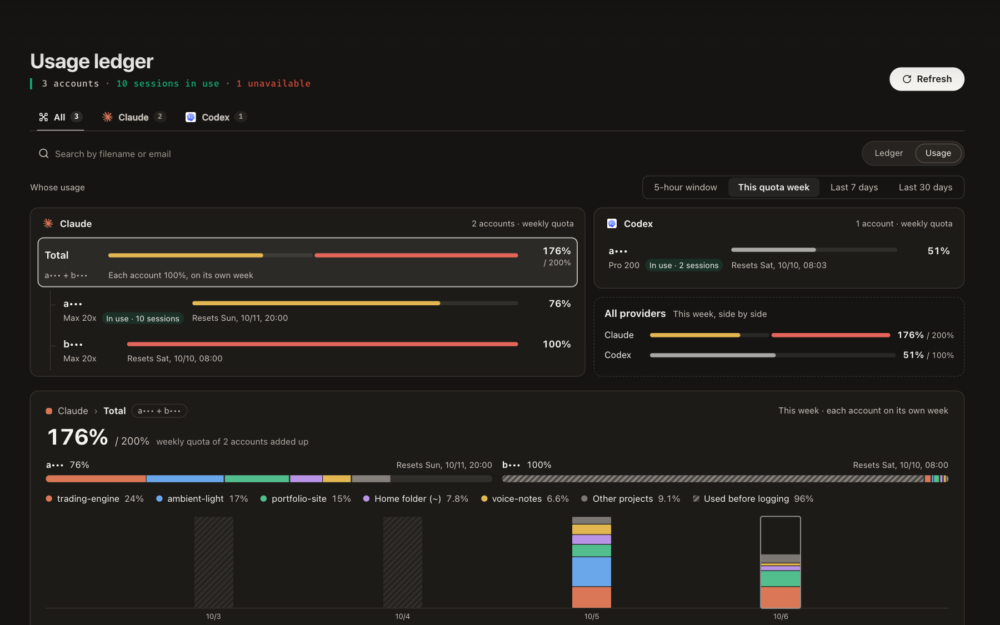
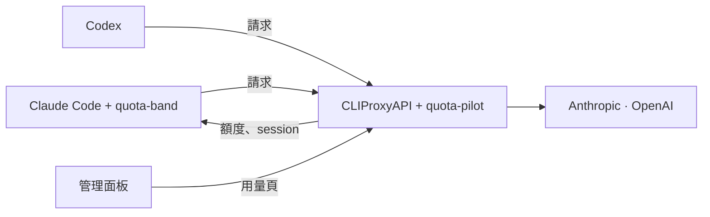
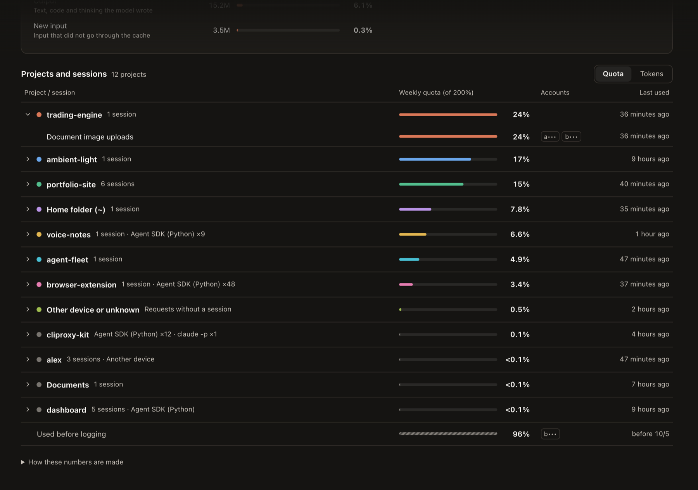

# cliproxy-kit

[English](README.md) | 繁體中文

[](https://github.com/kuan0808/cliproxy-kit/actions/workflows/ci.yml)
[](LICENSE)


替 [CLIProxyAPI](https://github.com/router-for-me/CLIProxyAPI) 依額度分配帳號，並在管理面板加上用量頁、在
Claude Code 加上額度列（band）。




> **預覽版。** 1.0 以前的版本，設定和資料檔都可能變動。目前支援 Claude 和 Codex 帳號，其他供應商交給
> CLIProxyAPI 原本的路由處理。

## 功能

- **把每個 session 放到對的帳號。** 新的 Claude Code session 會分到 5 小時額度還夠、而且每週額度最早重置的
  帳號，讓快到期的額度先用掉。之後 session 會留在同一個帳號，保住 prompt 快取；閒置超過 1 小時、快取已經
  過期時，如果帳號額度偏低，就會換到更好的帳號。
- **看得到額度用在哪裡。** 管理面板裡的頁面，依經過 proxy 的請求，把每個帳號這一週（或近 7、30 天）的用量
  拆到專案和 session。
- **在工作的地方就看得到額度。** Claude Code 輸入框上方的額度列，顯示目前帳號、5 小時和每週用量、context、
  prompt 快取和所有帳號的狀態，一鍵就能切換帳號或供應商。
- **供應商之間交棒。** Claude 帳號全部用完時，session 可以手動改用 Codex 模型；打開設定後也能自動切換。

由三個部分組成，一起發布：

| 部分 | 是什麼 |
| --- | --- |
| **quota-pilot** | CLIProxyAPI 的 plugin：選帳號、讀額度、記錄用量，以及用量頁。 |
| **quota-band** | Claude Code 的 plugin（mod），畫出額度列。 |
| **用量頁** | 內建在 quota-pilot 裡，從面板側邊欄開啟。 |



怎麼決定、存了哪些資料，寫在 [docs/architecture.md](docs/architecture.md)（英文）。

## 需求

- [CLIProxyAPI](https://github.com/router-for-me/CLIProxyAPI) 8.0.14 以上，執行在 macOS 或 Linux（amd64 或
  arm64），並已登入你的 Claude 和 Codex 帳號。
- 額度列需要 [Claude Code](https://code.claude.com) 2.1.287 以上。
- 要計算 Codex 的用量，Codex 要設定成經過 proxy（第 3 步）。

## 安裝

### 1. 把 quota-pilot 加進 CLIProxyAPI

在 CLIProxyAPI 的 `config.yaml` 把這個 repository 加成插件商店來源，並開啟插件：

```yaml
plugins:
  enabled: true
  store-sources:
    - "https://raw.githubusercontent.com/kuan0808/cliproxy-kit/main/registry.json"
```

接著在管理面板打開**插件商店**，安裝 **Quota Pilot**，裝好就會啟用。重新整理面板後，它的頁面在側邊欄的
**插件**底下。之後的更新也從商店來。如果安裝失敗（連到 GitHub 很慢時可能中斷），再裝一次，或改用手動安裝。

<details>
<summary>手動安裝，或從原始碼安裝</summary>

- **手動：** 從 [Releases](https://github.com/kuan0808/cliproxy-kit/releases) 下載對應系統的 zip（Apple
  晶片選 `darwin_arm64`，大多數伺服器選 `linux_amd64`），把裡面的函式庫放進 CLIProxyAPI 的插件資料夾
  （`plugins.dir`），設定 `plugins.configs.quota-pilot.enabled: true`，再重新啟動 CLIProxyAPI。
- **從原始碼**（需要 Go 1.26、Bun 和 C 編譯器）：`scripts/install-plugin.sh` 會建置、測試，並安裝到這台
  機器上的 proxy。它會詢問 management key，從 proxy 的設定找出插件資料夾；proxy 由 Homebrew 或 systemd
  執行時會自動重新啟動。如果 `plugins.dir` 是預設的相對路徑，或用其他方式執行 proxy，請指定位置和重啟方式：
  `CPA_PLUGINS_DIR=/path/to/plugins CPA_RESTART_CMD="docker restart cliproxyapi" scripts/install-plugin.sh`。

</details>

### 2. 連接 Claude Code 並安裝額度列

在執行 Claude Code 的機器上：

```sh
bash <(curl -fsSL https://raw.githubusercontent.com/kuan0808/cliproxy-kit/main/scripts/connect-claude-code.sh)
```

它會詢問 proxy 的一把 client key（`access.api-keys`），確認 proxy 接受這把 key，把 proxy 寫進 Claude Code
的使用者設定（舊檔會留一份備份），並安裝額度列。開一個新的 session，額度列就會出現在輸入框上方。

<details>
<summary>它改了什麼，手動設定的方式</summary>

在 `~/.claude/settings.json` 的 `env` 裡：

```json
"ANTHROPIC_BASE_URL": "http://127.0.0.1:8317",
"ANTHROPIC_AUTH_TOKEN": "<proxy 的 client key>",
"CLAUDE_CODE_PROMPT_CACHE_TTL": "1h",
"ENABLE_TOOL_SEARCH": "true",
"ENABLE_CLAUDEAI_MCP_SERVERS": "false"
```

1 小時的快取讓長 session 比較省；tool search 讓經過 proxy 的 prompt 保持精簡；claude.ai 的 connector
無法經過 proxy 使用。接著：

```sh
claude plugin marketplace add kuan0808/cliproxy-kit
claude plugin install quota-band@cliproxy-kit
```

</details>

### 3. 讓 Codex 經過 proxy（選用）

quota-pilot 只計算經過 proxy 的用量。照 CLIProxyAPI 的
[Codex 設定指南](https://help.router-for.me/agent-client/codex)（OAuth 登入模式）設定
`~/.codex/config.toml`：

```toml
model_provider = "cliproxyapi"

[model_providers.cliproxyapi]
name = "OpenAI"
base_url = "http://127.0.0.1:8317/v1"
model_catalog_url = "http://127.0.0.1:8317/v1/models"
experimental_bearer_token = "<proxy 的 client key>"
wire_api = "responses"
requires_openai_auth = true
supports_websockets = true

[features]
api_key_model_discovery = true
```

Codex 0.156 以上一定要有 `model_catalog_url` 和 `api_key_model_discovery`：少了它們，Codex 讀不到模型的
資料，請求會大很多，也會變慢。每個 Codex session 都會依它的資料夾和第一則訊息顯示在用量頁。

### 其他機器

其他機器上的 Claude Code 也能透過加密連線使用同一個 proxy，例如
[Tailscale Serve](https://tailscale.com/kb/1312/serve)，它會提供 https 位址。先把那台要用的 key 加進
`band_tokens`（見下方設定），再到那台執行同一行指令，加上 proxy 的位址：

```sh
bash <(curl -fsSL https://raw.githubusercontent.com/kuan0808/cliproxy-kit/main/scripts/connect-claude-code.sh) https://proxy.example.ts.net:8317
```

那台的 session 會依名稱顯示在用量頁，並標示為其他裝置。切換 session 的帳號或供應商，只在執行 proxy 的
那台機器上提供。proxy 跑在這台機器的 Docker 裡時也一樣：額度列會從網路讀取額度，所以它的 key 也要加進
`band_tokens`。

如果是其他機器上的 `http://` 位址，腳本會拒絕執行，因為 key 會以明文經過網路；如果網路本身已經加密（例如
VPN），可以設定 `ALLOW_HTTP=1`。

## 使用

**在 Claude Code 裡**，額度列在 Claude 等待時顯示方塊，工作時縮成一行。按鈕：

- `switch`：把這個 session 換到另一個帳號，或另一個供應商的模型，也能換回來。
- `quota`：所有帳號的各個額度週期；輸入 `/quota` 也一樣。
- `more` / `less`：在換輪之前固定顯示方塊或一行。
- `compact`、`handoff`：prompt 快取快過期或即將換帳號時出現，避免下一輪重寫一大段對話的快取。

**在管理面板裡**，打開「插件」底下的 **quota-pilot**。登入面板時有勾選「記住密碼」，頁面就直接沿用；否則每個
分頁會詢問一次 management key。

| 檢視 | 內容 |
| --- | --- |
| 帳本 | 依新 session 分配順序列出每個帳號，以及各額度週期和原因。 |
| 用量 | 每個帳號這一週，或近 7、30 天，依專案和 session 拆開；還有 token、快取命中率和每日用量。 |



安裝 quota-pilot 之前的日子沒有額度讀數。在 proxy 那台執行一次 `python3 scripts/usage-backfill.py`，可以從
Claude Code 的對話記錄補回這些日子的 token 數。

## 設定

在面板的**插件管理**頁面，或 `config.yaml` 的 `plugins.configs.quota-pilot` 底下：

| 設定 | 預設 | 作用 |
| --- | --- | --- |
| `min_five_hour_left_percent` | `25` | 新的 session 不會分到 5 小時額度剩不到這個百分比的帳號，除非它 30 分鐘內就重置。 |
| `cross_provider` | `off` | `auto`：某個供應商的帳號全部用完時，自動把 session 改送到 `fallback_map` 的模型；`off`：交給 `switch` 手動切換。 |
| `fallback_map` | 無 | 各供應商改用的模型，寫成 `供應商: 供應商:模型`，例如 `claude: codex:gpt-6.1-sol`。 |
| `idle_poll_minutes` | `10` | 多久讀一次閒置帳號的額度。 |
| `context_lengths` | 內建表 | 各模型的 context 大小，用來判斷對話放不放得進另一個模型。 |
| `band_tokens` | 無 | 允許其他機器上的額度列讀取額度的 client key。 |

## 隱私與安全

- quota-pilot 是設計給單一擁有者使用的：proxy 的每一把 client key 都視為可信。client 可以用它的請求替
  session 命名；列在 `band_tokens` 裡的 key 能讀到所有帳號的額度，以及它自己的 session。只把 key 給你願意
  讓他看到用量的人。
- 所有資料都留在執行 proxy 的機器上，放在 `~/.cache/cliproxy-kit/`（權限 0600）。除了它轉送的請求，plugin
  只會用帳號既有的 token 呼叫供應商自己的用量和帳號資料端點。
- 為了替 session 命名，它會讀那台機器上 Claude Code 的對話記錄，所以 proxy 應該用和 Claude Code 相同的使用者
  執行。
- 頁面本身不含任何資料：它顯示的一切都經過 management 路由，需要 management key。額度列走網路時，需要列在
  `band_tokens` 裡的 key，而且不含 email 或路徑。

## 開發

```sh
cd plugin && go test ./...                                   # plugin
cd ui && bun install && bun run verify                       # 頁面：測試、lint、型別、建置
cd mod && claude plugin test . && claude plugin validate .   # 額度列
```

`scripts/install-plugin.sh` 會安裝本機建置的版本；`git config core.hooksPath scripts/git-hooks` 會開啟 commit
前的憑證檢查（需要 PyYAML）。打上 `v<版本>` tag 會發布插件商店安裝用的 release，版本必須和
`mod/.claude-plugin/plugin.json` 裡額度列的版本一致。

## 免責聲明

本專案與 Anthropic、OpenAI 和 CLIProxyAPI 專案都沒有關係。透過 proxy 使用訂閱帳號，可能牴觸供應商的條款；
使用前請自行確認，風險自負。

## 授權

[MIT](LICENSE)。用量頁沿用了 CLIProxyAPI 管理面板的樣式和元件，依其 MIT 授權
（[ui/LICENSE.panel](ui/LICENSE.panel)）。
