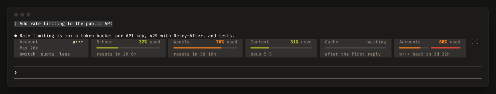
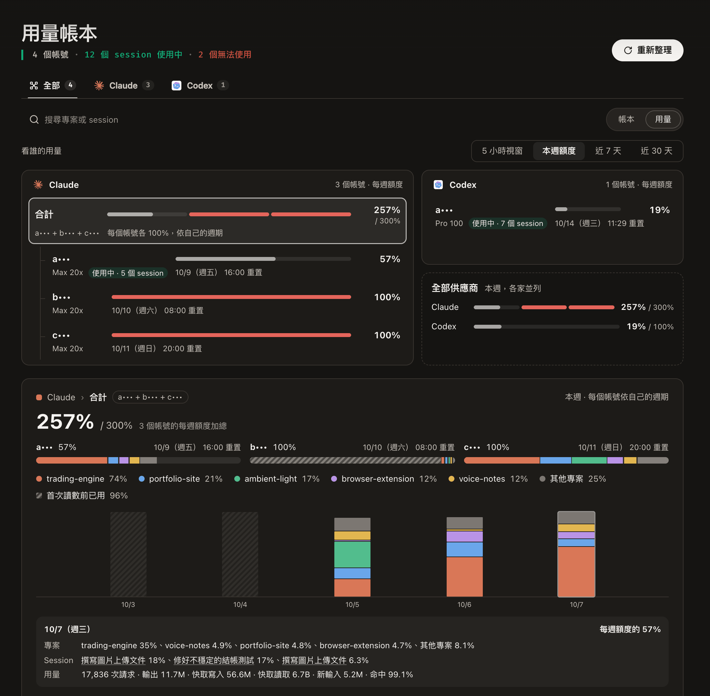
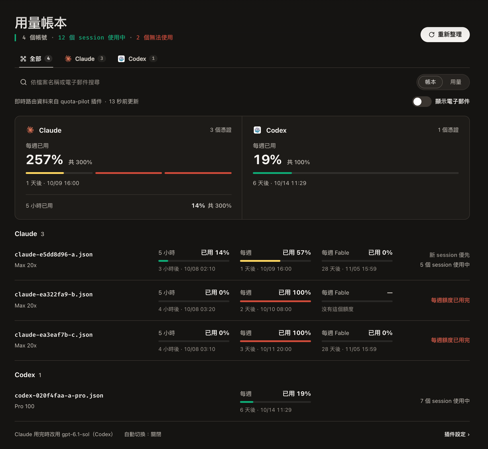
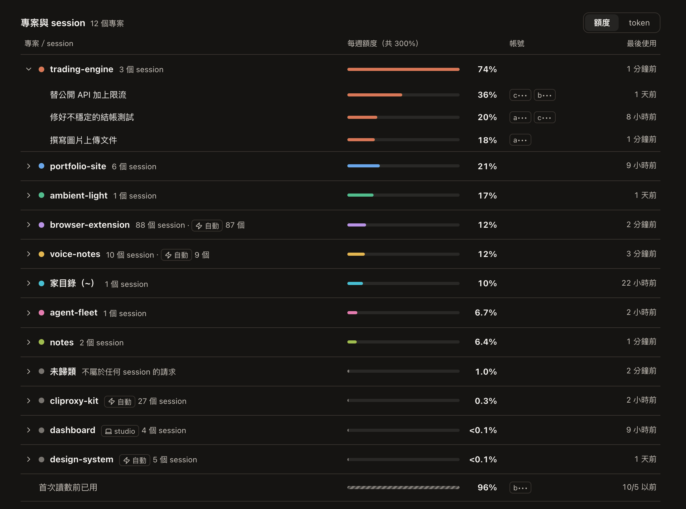

<p align="center">
  
</p>

<h1 align="center">cliproxy-kit</h1>

<p align="center">
  <b>讓每個 Claude Code session 都跑在對的訂閱帳號上，<br>也看得清楚額度用到哪裡去。</b>
</p>

<p align="center">
  <a href="https://github.com/kuan0808/cliproxy-kit/actions/workflows/ci.yml"></a>
  <a href="https://github.com/kuan0808/cliproxy-kit/releases/latest"></a>
  <a href="LICENSE"></a>
  
</p>

<p align="center">
  <a href="#快速開始">快速開始</a> ·
  <a href="#使用">使用</a> ·
  <a href="#設定">設定</a> ·
  <a href="#疑難排解">疑難排解</a> ·
  <a href="docs/architecture.md">運作原理</a>
  <br>
  <a href="README.md">English</a> · 繁體中文
</p>

<p align="center">
  
</p>

給透過 [CLIProxyAPI](https://github.com/router-for-me/CLIProxyAPI) 使用多個訂閱帳號跑 Claude Code 和 Codex 的人：一個 proxy 插件（**quota-pilot**），附帶管理面板裡的用量頁，以及 Claude Code 裡的額度列（**quota-band**）。

- 🧭 **每個 session 分到對的帳號。** 新的 session 分到每週額度最快重置的帳號，快過期的額度先用掉；之後就留在那個帳號，prompt 快取也跟著保留。Codex 的 session 和 review 也一樣。
- 📊 **額度用到哪裡去。** 管理面板裡的頁面，把每個帳號的 5 小時視窗、這一週、近 7 或 30 天，依專案和 session 拆開。
- 🎛️ **在工作的地方看額度。** Claude Code 輸入框上方的額度列，顯示帳號、用量、context 和 prompt 快取，一鍵就能切換。
- 🔀 **供應商之間交接。** Claude 帳號全部用完時，session 可以手動換到 Codex 的模型，也可以設定成自動。

<table>
  <tr>
    <td width="50%"><b>用量</b>：每個帳號這一週，依專案和日期</td>
    <td width="50%"><b>帳本</b>：依分配順序列出每個帳號</td>
  </tr>
  <tr>
    <td></td>
    <td></td>
  </tr>
</table>

> [!NOTE]
> **預覽版。** 1.0 之前，設定和資料檔都可能變動。支援 Claude 和 Codex 帳號；其他供應商照常由 CLIProxyAPI 自己分配。

## 快速開始

需要 macOS 或 Linux 上的 [CLIProxyAPI](https://github.com/router-for-me/CLIProxyAPI) 8.0.14 以上，並已登入你的帳號；以及 [Claude Code](https://code.claude.com) 2.1.287 以上。

**1. 安裝 quota-pilot。** 在 CLIProxyAPI 的 `config.yaml` 開啟插件，並加入這個商店：

```yaml
plugins:
  enabled: true
  store-sources:
    - "https://raw.githubusercontent.com/kuan0808/cliproxy-kit/main/registry.json"
```

接著在管理面板的**插件商店**安裝 **Quota Pilot**，重新整理面板：它的頁面在**插件**底下。

<details>
<summary>手動安裝，或從原始碼安裝</summary>

- **手動：** 從 [release](https://github.com/kuan0808/cliproxy-kit/releases/latest) 下載你的系統的 zip（Apple 晶片選 `darwin_arm64`，大多數伺服器選 `linux_amd64`），把裡面的程式庫放進 CLIProxyAPI 的插件資料夾（`plugins.dir`），設定 `plugins.configs.quota-pilot.enabled: true`，再重新啟動 CLIProxyAPI。
- **從原始碼**（需要 Go 1.26、Bun 和 C 編譯器）：`scripts/install-plugin.sh` 會建置、測試並安裝，由 Homebrew 或 systemd 執行的 proxy 會自動重新啟動，最後確認 proxy 跑的就是這個版本。其他執行方式請指定位置和重啟方式：`CPA_PLUGINS_DIR=/path/to/plugins CPA_RESTART_CMD="docker restart cliproxyapi" scripts/install-plugin.sh`。

</details>

**2. 連接 Claude Code。** 在你執行 Claude Code 的機器上：

```sh
bash <(curl -fsSL https://raw.githubusercontent.com/kuan0808/cliproxy-kit/main/scripts/connect-claude-code.sh)
```

它會詢問一把 proxy 的 client key，確認 proxy 接受它，讓 Claude Code 改走 proxy，並安裝額度列。開一個新的 session，額度列就會出現在輸入框上方。

<details>
<summary>它改了什麼（要手動設定時）</summary>

在 `~/.claude/settings.json`（舊檔會保留在旁邊，名為 `settings.json.bak-<時間>`）的 `env` 底下：

```json
"ANTHROPIC_BASE_URL": "http://127.0.0.1:8317",
"ANTHROPIC_AUTH_TOKEN": "<proxy 的一把 client key>",
"CLAUDE_CODE_PROMPT_CACHE_TTL": "1h",
"ENABLE_TOOL_SEARCH": "true",
"ENABLE_CLAUDEAI_MCP_SERVERS": "false"
```

1 小時的快取讓長 session 比較省；tool search 讓經過 proxy 的 prompt 保持精簡；claude.ai 的連接器無法經過 proxy 使用。接著：

```sh
claude plugin marketplace add kuan0808/cliproxy-kit
claude plugin install quota-band@cliproxy-kit
```

</details>

**3. 讓 Codex 經過 proxy**（選用）。quota-pilot 只看得到經過 proxy 的請求：照 CLIProxyAPI 的[Codex 指南](https://help.router-for.me/agent-client/codex)設定 Codex。

<details>
<summary><code>~/.codex/config.toml</code></summary>

```toml
model_provider = "cliproxyapi"

[model_providers.cliproxyapi]
name = "OpenAI"
base_url = "http://127.0.0.1:8317/v1"
model_catalog_url = "http://127.0.0.1:8317/v1/models"   # Codex 0.156 起需要
experimental_bearer_token = "<proxy 的一把 client key>"
wire_api = "responses"
requires_openai_auth = true
supports_websockets = true

[features]
api_key_model_discovery = true   # Codex 0.156 起需要
```

少了這兩行，Codex 0.156 以上讀不到模型的資料，請求會大很多。

</details>

**4. 在 Codex 裡顯示額度**（選用）。Codex 沒有可以自訂的狀態列，經過 proxy 時底部也不會顯示用量上限；加上兩個 hook 就會印出一行：session 開始時顯示帳號和用量，之後只在換了帳號、帳號用量超過 80% 或用完時才提醒。

<details>
<summary>加進 <code>~/.codex/config.toml</code>，key 和位址與上面相同</summary>

```toml
[[hooks.SessionStart]]
[[hooks.SessionStart.hooks]]
type = "command"
command = '''id=$(sed -n 's/.*[{,]"session_id":"\([^"]*\)".*/\1/p'); printf 'Authorization: Bearer %s\nX-Codex-Session: %s\n' '<proxy 的一把 client key>' "$id" | curl -fs -m 3 -H @- "http://127.0.0.1:8317/v0/resource/plugins/quota-pilot/codex?event=SessionStart"'''

[[hooks.Stop]]
[[hooks.Stop.hooks]]
type = "command"
command = '''id=$(sed -n 's/.*[{,]"session_id":"\([^"]*\)".*/\1/p'); printf 'Authorization: Bearer %s\nX-Codex-Session: %s\n' '<proxy 的一把 client key>' "$id" | curl -fs -m 3 -H @- "http://127.0.0.1:8317/v0/resource/plugins/quota-pilot/codex?event=Stop"'''
```

只需要 `curl`。Codex 第一次會請你確認信任這兩個 hook。每一行都以提示顯示，不會進到模型的 context。

</details>

### proxy 跑在哪裡

每個部分都只連 proxy 的位址，所以 proxy 可以和 Claude Code 在同一台、跑在容器裡，或是在完全不跑 client 的伺服器上。

| 情況 | 要改什麼 |
| --- | --- |
| **同一台機器** | 不用改：照上面步驟 1 到 4。 |
| **Docker** | 把 proxy 使用者的 `~/.cache/cliproxy-kit/` 放在 volume 上（大多數映像檔是 `/root/.cache/cliproxy-kit`），否則重新啟動就會遺失記錄和狀態。 |
| **另一台機器** | 透過加密的位址連到 proxy，例如 [Tailscale Serve](https://tailscale.com/kb/1312/serve) 提供的位址，再把這個位址交給連接指令和 Codex。 |

```sh
bash <(curl -fsSL https://raw.githubusercontent.com/kuan0808/cliproxy-kit/main/scripts/connect-claude-code.sh) https://proxy.example.ts.net:8317
```

- **裝置。** 前面有 Tailscale Serve 這類反向代理時，proxy 才知道請求從哪裡來：其他裝置的 session 會在用量頁標上裝置名稱（MagicDNS），查不到名稱時標成「其他裝置」。直接連到 port 的 client 無法區分。
- **名稱。** proxy 只有和 Claude Code 在同一台、用同一個使用者執行時，才會讀它的對話記錄。其他情況由額度列替每個 session 命名；沒裝額度列時，session 會沿用第一個請求當標題。
- **純 http。** 其他機器上的 `http://` 位址會被腳本拒絕；網路本身已經加密時（例如 VPN），可以設定 `ALLOW_HTTP=1`。

### 有沒有裝額度列

quota-pilot 單獨就能運作；額度列補上只有 Claude Code 裡才能顯示或做到的事。

| | 只有 quota-pilot | 加上額度列 |
| --- | :---: | :---: |
| 每個 session 分到帳號，並保留 prompt 快取 | ✅ | ✅ |
| 用量頁：帳號、專案、session | ✅ | ✅ |
| session 標題 | 第一個請求¹ | 目前的標題，任何裝置都是 |
| 同一個 repo 跨裝置算成一個專案 | 依資料夾 | ✅ |
| 輸入框上方的帳號、額度、context 和快取 | | ✅ |
| 手動切換帳號或供應商 | | ✅ |
| 快取過期前的 `compact` 和 `handoff` | | ✅ |

¹ proxy 和 Claude Code 在同一台、用同一個使用者執行時，會是目前的標題，包含你改過的名稱。

## 使用

### 在 Claude Code 裡

額度列在 Claude 等待時顯示方塊，工作時縮成一行。

| 按鈕 | 作用 |
| --- | --- |
| `switch` | 把這個 session 換到另一個帳號，或另一個供應商的模型，也能換回來。 |
| `quota` | 所有帳號的各個額度週期；輸入 `/quota` 也一樣。 |
| `more` / `less` | 在換輪之前固定顯示方塊或一行。 |
| `compact`、`handoff` | prompt 快取快過期或即將換帳號時出現，避免下一輪重寫一大段對話的快取。 |

### 在管理面板裡

打開**插件**底下的 **quota-pilot**。登入面板時勾選了「記住密碼」，頁面就直接沿用；否則每個分頁會詢問一次 management key。

- **帳本：** 依新 session 分配順序列出每個帳號、各額度週期，以及限制它的原因。
- **用量：** 每個帳號的 5 小時視窗、這一週，或近 7、30 天，依專案和 session 拆開，附上 token 和快取命中率。日期依你的時區劃分。
- **重新整理：** 立刻讀取每個帳號的額度，讀不到的帳號會列出來並說明原因。



### 值得知道

- **額度提前重新計算時**（例如變更方案），從那一刻重新計算；之前的用量仍在近 7、30 天的檢視裡。
- **Fast 模式：** Codex 的 Fast（`service_tier = "fast"`）以 2.5 倍速度消耗方案額度，也照這個比例計算。Claude Code 的 `/fast` 計入用量點數，不計入方案額度，所以不算進帳號的額度；經過 proxy 時，要設定 `CLAUDE_CODE_SKIP_FAST_MODE_ORG_CHECK=1`，Claude Code 才會提供 `/fast`。
- **多個 Codex 帳號**會像 Claude 帳號一樣分配 session；改用另一個供應商只適用於 Claude Code 的 session。

## 設定

在面板的**插件管理**頁面，或 `config.yaml` 的 `plugins.configs.quota-pilot` 底下：

| 設定 | 預設 | 作用 |
| --- | --- | --- |
| `min_five_hour_left_percent` | `25` | 新的 session 不會分到 5 小時額度剩不到這個百分比的帳號，除非它 30 分鐘內就重置。 |
| `cross_provider` | `off` | `auto`：某個供應商的帳號全部用完時，自動把 Claude Code 的 session 改送到 `fallback_map` 的模型；`off`：交給 `switch` 手動切換。 |
| `fallback_map` | 無 | 各供應商改用的模型，寫成 `供應商: 供應商:模型`，例如 `claude: codex:gpt-6.1-sol`。 |
| `idle_poll_minutes` | `10` | 多久讀一次閒置帳號的額度。 |
| `context_lengths` | 內建表 | 各模型的 context 大小，用來判斷對話放不放得進另一個模型。 |

## 它改了什麼

| 位置 | 內容 | 還原方式 |
| --- | --- | --- |
| CLIProxyAPI 的 `config.yaml` | 開啟 `plugins:`、加入商店，以及 quota-pilot 的設定 | 刪掉這些設定。 |
| proxy 使用者的 `~/.cache/cliproxy-kit/` | 狀態、請求記錄，以及每個 session 的資料（權限 0600；client key 只存雜湊） | 刪掉這個資料夾。 |
| 每台跑 Claude Code 的 `~/.claude/settings.json` | 步驟 2 的 `env` 設定；原本的檔案保留為 `settings.json.bak-<時間>` | 把備份放回去。 |
| Claude Code 的插件 | `cliproxy-kit` marketplace 和 `quota-band` | `claude plugin uninstall quota-band@cliproxy-kit` |
| 額度列那台的 `~/.cache/cliproxy-kit/handoff/` | `handoff` 寫的交接筆記 | 刪掉這個資料夾。 |
| `~/.codex/config.toml`（選用） | 步驟 3 的 model provider 和步驟 4 的 hook | 刪掉這些設定。 |

## 更新與移除

- **更新：** 面板的插件商店會提供 quota-pilot 的新版本；額度列用 `claude plugin update quota-band@cliproxy-kit` 更新。
- **移除：** 在面板的**插件**頁面刪除 Quota Pilot，其餘照上表還原。

## 疑難排解

| 你看到 | 這樣處理 |
| --- | --- |
| 從商店安裝失敗 | 面板只等 30 秒，從 GitHub 下載 2 MB 太慢就會失敗：改用手動安裝（步驟 1）。 |
| 插件底下沒有 quota-pilot | 重新整理面板，並確認 `plugins.enabled: true`。 |
| 額度列說這把 key 送出請求後才有額度資料 | 送出一個 prompt：proxy 最近一週還沒接受過這把 key 的請求。 |
| 額度列說額度資料太舊 | proxy 或裡面的插件停了：重新啟動 CLIProxyAPI。 |
| 用量頁看不到 Codex 的 session | Codex 還沒經過 proxy（步驟 3）。 |
| Codex 說 hook 以代碼 7 或 22 結束 | hook 的位址沒有 proxy 回應（7），或那個 proxy 上沒有 quota-pilot（22）。 |
| Codex 帳號沒有 5 小時視窗 | 它的方案本來就沒有；頁面和額度列都會標明。 |

## 隱私與安全

- **單一擁有者。** proxy 的每一把 client key 都視為可信。proxy 接受過某把 key 的請求後，這把 key 就能讀到所有帳號的額度（遮蔽過的名稱，不含 email 或路徑），也能替它開的 session 命名、切換帳號。只把 key 給你願意讓他看到用量的人；從 proxy 移除的 key 最多還能讀一週。
- **留在本機。** 所有資料都放在 proxy 使用者的 `~/.cache/cliproxy-kit/`（權限 0600），client key 只存雜湊。除了轉送的請求，插件只會用帳號既有的 token 呼叫供應商自己的用量和帳號資料端點，以及查詢裝置名稱的 DNS。
- **對話記錄。** 它只讀自己那台機器上、同一個使用者的 Claude Code 對話記錄。
- **都在金鑰後面。** 頁面本身不含任何資料，一切都經過 management 路由讀取，需要 management key。額度列和 Codex hook 的路由需要 proxy 接受過的 client key。

## 開發

```sh
cd plugin && go test ./...                                   # 插件
cd ui && bun install && bun run verify                       # 頁面：測試、lint、型別、建置
cd mod && claude plugin test . && claude plugin validate .   # 額度列
```

`scripts/install-plugin.sh` 會安裝本機建置的版本。`git config core.hooksPath scripts/git-hooks` 會開啟 commit 前的憑證檢查（需要 PyYAML；讀 Codex 的設定需要 Python 3.11 以上）。打上 `v<版本>` tag 會發布商店安裝用的 release，版本必須和 `mod/.claude-plugin/plugin.json` 一致。各部分怎麼決定、存了什麼：[docs/architecture.md](docs/architecture.md)。

## 授權

[MIT](LICENSE)。頁面沿用了 CLIProxyAPI 管理面板的樣式和元件，依其 MIT 授權使用（[ui/LICENSE.panel](ui/LICENSE.panel)）。

與 Anthropic、OpenAI 或 CLIProxyAPI 專案無關。透過 proxy 使用訂閱帳號可能違反供應商的條款；使用前請先確認，並自行承擔風險。
