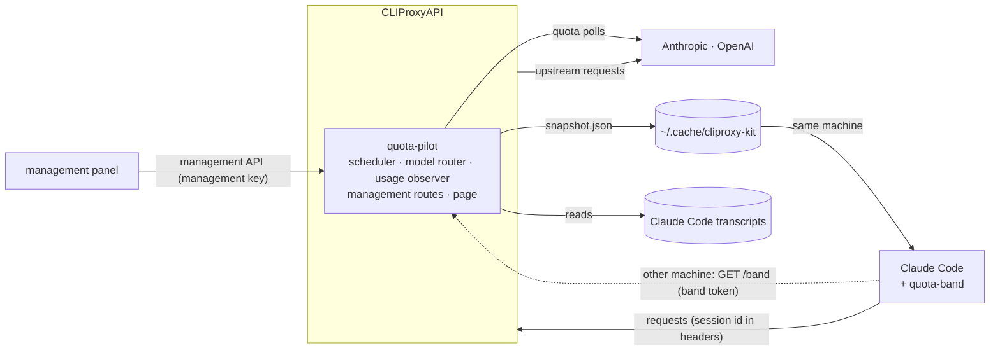

# How cliproxy-kit works

Three parts, one version, released together:

| Part | Folder | Language | Runs in |
| --- | --- | --- | --- |
| quota-pilot | `plugin/` | Go, built as a C shared library | CLIProxyAPI, through its plugin C ABI |
| quota-pilot page | `ui/` | React, built into one HTML file | the management panel, served by the plugin |
| quota-band | `mod/` | TypeScript | Claude Code, as a mod (function hooks) |

## quota-pilot

The plugin declares five capabilities: `scheduler` (across priorities), `model_router`,
`usage_plugin`, `request_interceptor` and `management_api`. It is the only place that chooses an
account and the only producer of quota data; the band and the page only read it.

### Choosing an account

Every pick that carries a session id (Claude Code's header, or the host's canonical id, as for
Codex) is answered with a concrete account, so the native selector never moves a session; a pick
without one is left to the native selector. A session's account is bound per conversation thread
and provider, and inherited by its subagents; a Codex request is a thread of its own, so a review
Codex runs beside a session gets its own binding. A side request (a Claude request without tools or
a thread, as a title or a summary) takes the session's account and never moves it. A new binding
takes, in order:

1. the account the user switched the session to, when it is offered;
2. accounts with weekly quota left for the model and enough of their 5-hour window: at least
   `min_five_hour_left_percent` (25 by default) left, or a reset within 30 minutes. Among these the
   soonest weekly reset comes first, so quota that would expire unused is used first; a model with
   a weekly window of its own (Fable) goes by that window's reset;
3. accounts whose quota is not known yet;
4. accounts low on their 5-hour window, or used up.

Within each, an account that can serve the model comes before one that cannot (its own weekly
window used up, as Opus's), and ties break by account id. The threshold is compared after rounding
to the whole percent the provider reports. A binding moves only after a success elsewhere: when its
account stops being offered (removed, used up), not on a failed retry, a side request or a
subagent; a cooldown the host already took into account when it offered the candidates does not
count again. Only a 429 is a quota refusal, and a refusal moves only the model it was for: a
session refused for Opus keeps its account for Sonnet. A request's send time goes with its
binding, and moves on with each later request its account serves, so an answer sent before
either and arriving late does not take the thread elsewhere.
An account read as used up often answers a while longer, so its sessions stay until it turns a
request away; from then on each of them leaves at its next request for a ready account, without
waiting to be refused itself. It also moves when its session has been idle for an hour, so its
prompt cache is gone anyway, while its account is no longer one a new session would get: the next
request goes to the best account at no cost. A session the user switched stays. Bindings and routes
live in `state.json` for 24 hours after their last use, so a resumed session keeps its account and
prompt cache.

### Moving a session to another provider

`cross_provider: off` (the default) never changes provider: the band offers a one-press switch to
the model `fallback_map` names. `auto` moves a session only when every account of its provider is
used up on fresh data, never on unknown data, with an account list read in the last 30 seconds, and
only when the conversation fits the target model's context (`context_lengths`, else a table by
model family). What a conversation needs is the larger of its last request's input tokens and its
body (a token per 3 bytes, 1,600 per image or file), plus the output it asks for. A thread
continuation sent to another provider is answered `400 thread_unsupported_request`, which makes
Claude Code resend the whole conversation. Moving to another provider is for Claude Code sessions:
Codex chooses its own model.

### Reading quota

Quota comes from the rate-limit headers of every response (Claude's `anthropic-ratelimit-unified-*`,
Codex's `x-codex-*`) and, for idle accounts, from each provider's usage endpoint every
`idle_poll_minutes`, using the account's own token through the host, four accounts at a time.
Polling pauses after 15 minutes without any request, because a plugin turned off in the config is
never told, and resumes with the next one; the page's Refresh reads every account at once and says
which it could not read and why (its login, refused, asked to slow down, another status, the
network, an unreadable answer, or out of time). A usage-endpoint reading is complete: a window it does
not name (a Codex plan without a 5-hour window, a Claude model window such as Fable's that the
account lacks) is gone, and the band and the page say the account has no such limit; a Claude answer
that names no window at all is no reading. Headers name only some windows and never remove one. A Claude account's
plan is read from its profile, whether or not its usage read worked, when first seen, every hour,
on Refresh and after its window started over; a Codex plan comes with each usage reading. The last
readings survive a restart in `state.json`, marked stale as they age.

The live state and the report follow one set of window rules (`core/window.go`):

- A reading names its window by the reset it reports; one naming an earlier reset is late and
  passed over, one naming a later reset begins a new window.
- Within a window the highest reading stands, whatever order the readings come in. A reading read
  before one already taken (a long request's headers, timed when it was sent) says nothing newer.
- A fall of more than 5 points waits up to 5 minutes. It is the window starting over in place (a
  plan change, a reset the user asked for; Claude keeps the reset time) when the last reading of the
  window within those 5 minutes is nearer the fall than the highest, or none comes; otherwise it was
  a late reading. After a start-over, readings nearer the old highest within 5 minutes are late.
- For an hour after a plan change any fall starts the window over.

### Where quota went

Every request is logged (`usage/YYYY-MM.jsonl`, three months) with its session, account, model,
tokens, whether it came from another device, and the service tier it asked for (`auto` when it named
none) and the one the provider reported (Codex sends Fast as `priority`). The ChatGPT backend that
answers a Codex account signed in with ChatGPT reports `default` whatever tier served the request
(Fast measured 1.5x as fast and still read `default`), so its report is not kept. Each rise of an
account's weekly reading is shared among the requests since the previous rise, weighted by tokens
(output 5x, cache write 2x, cache read 0.1x), model tier and speed: Codex's Fast counts 2.5x, as
Codex's pricing says, and Claude's fast mode 0, as it draws on usage credits, not plan limits, so a
rise read beside only fast-mode requests is use elsewhere. A
rise no request explains, such as use on claude.ai or another tool, is reported as not matched to
a request; what the first reading already showed used is reported apart and never split. A range is
known only from readings inside it, so an account without one shows as unknown, not as 0%.

The report runs the window rules above over the logged readings, so it and the live state agree; a
plan change is logged as a line of its own, after which a request's use is learned anew, and the
current week counts from where it started over. A fall within 5 minutes of the report's end still
waits, as it does live. Days are the page's: it sends its time zone, and days, ranges and session
timelines follow it. Use read across midnight counts in the total, on no day, and the days it may
lie on say their figure is a floor, or not known.

An account logged in again under a new credential is the same provider account (a Claude seat, its
`account_uuid` in its `organization_uuid`, so personal and Team seats stay apart; a Codex
`account_id`; kept 100 days): the report counts it as one, and while the proxy holds both
credentials the snapshot names the second as the same account, so the ledger, the band and the
report count its quota once. Accounts are named by masked labels, kept apart with more letters, then
a number, when two would read alike.

Over 5 hours the same split runs on the 5-hour readings: each account's running window, and the
windows of the last day, told apart by the reset each reading names (logged from 0.1.4 on, so
earlier windows are not listed). For an idle account Claude still names a reset, a later one with
each reading: a window that used nothing and served no request shows as not running.

Claude Code sessions are named from their transcripts (the user's rename, else Claude Code's
title, else the first request); a Codex session, whose records the proxy does not read, by its
first request: the folder in its environment context and what it asked, kept as long as it runs.
A request came from another device when the last `X-Forwarded-For` entry (which a reverse proxy
such as Tailscale Serve appends, so a client cannot forge it) is not one of this machine's
addresses; a container on this machine that reaches the port directly is not told apart. A session's
device and what ran it are two tags on the page. Sessions are placed in projects by their
repository: the nearest `.git`, `.jj` or `.hg`, with worktrees (relative ones, and those of a bare
repository) under their main repository. A folder outside any repository is its own project. A
folder on another device, on Windows or on a share is never looked up: its project is its name.
Codex counts only what goes through the proxy, as Claude does, so Codex should be set up to use it
(see the README).

### Files

All under `~/.cache/cliproxy-kit/` of the user the proxy runs as, mode 0600, so one proxy per user:

| File | What |
| --- | --- |
| `snapshot.json` | accounts, quota, sessions and routes, for the band (rewritten atomically) |
| `state.json` | bindings, routes and the last quota readings |
| `commands/` | the band's switch and route requests, applied once and acknowledged in the snapshot |
| `usage/` | the request log, recovered history, and the sessions named by their requests or by the band on another machine |

### Management routes and the page

Under `/v0/management/quota-pilot/`, behind the management key: `snapshot`, `usage` and
`usage/session` (each with `tz`, the page's time zone), and `POST refresh`, which answers
`{read, failed: [{account, label, failure, status}], complete}`. Two resources, which CLIProxyAPI serves without
authentication: `/v0/resource/plugins/quota-pilot/ui`, the page (it carries no data and asks the
management routes for everything), and `/band`, the snapshot for a band on another machine, which
needs a key listed in `band_tokens` and carries opaque account ids.

## The page

One HTML file, built from `ui/` with the panel's own styles and components (MIT, see
`ui/LICENSE.panel`), embedded in the plugin. The panel lists it under Plugins and shows it in a
frame; only the panel's origin may frame it (`frame-ancestors 'self'`). It uses the management
key the panel saved when "remember password" was ticked, else one typed into the page and kept for
the tab; a refused key is not retried, since five wrong keys ban the address for 30 minutes. It
follows the panel's theme, language and width.

## quota-band

The band draws above the Claude Code prompt: tiles while Claude waits, one line while it works or
when the terminal is narrow, and one line also when another mod draws beneath it. It reads
`snapshot.json` when `ANTHROPIC_BASE_URL` is `localhost` or `127.0.0.1` and the file is at most 2
minutes old (the plugin rewrites it at least every minute); otherwise it reads `/band` with
`ANTHROPIC_AUTH_TOKEN` and sends the session's title, start folder and repository in `X-Band-*`
headers, so sessions on other machines are named in the usage report. When `/band` gives nothing it
says why (a key not in `band_tokens`, no plugin there, no answer) and shows the last snapshot as
old. Switching a session's account or provider writes to `commands/`, so it is offered only on the
machine that runs the proxy; the list leaves out accounts that cannot serve the session's model,
and a switch not confirmed within a minute, or across a proxy restart, says so. `compact` and
`handoff` work everywhere.

## Upstream behaviour it relies on

Checked against CLIProxyAPI 8.0.16 and Claude Code 2.1.289:

- A scheduler plugin that handles a pick bypasses the native selector, session affinity included.
- Pick requests carry `canonical_session_id` (`claude:<session>`, with `:agent:<id>` for a
  subagent) and `parent_session_id`.
- Usage records arrive once per upstream attempt, failures included, with the rate-limit headers.
- Resources registered by a plugin are served under `/v0/resource/plugins/<id>/` without
  authentication; its management routes need the management key.
- A plugin library replaced in place is loaded again only when the proxy restarts.
- Claude Code sends its session id in `X-Claude-Code-Session-Id`, and continues server-side message
  threads; an expired thread is answered `404 thread_not_found`, which CLIProxyAPI 8.0.14 and later
  pass through so Claude Code replays the conversation.

## Limitations

- Crossing providers changes the model and rewrites the prompt cache; Claude Code does not know a
  non-Claude model's context size, so its auto-compact timing may be off.
- Remote Control, voice dictation and claude.ai connectors do not work through a proxy.
- The cache countdown is an estimate: the server's cache state cannot be observed.
- Sessions are named from transcripts on the machine that runs the proxy, so it must run as the
  same user as Claude Code there; other machines need the band.
- A proxy in a container that clients reach directly sees no `X-Forwarded-For`, so their requests
  are not marked as from another device.
- The plugin is trusted in-process code: a crash takes the proxy down with it.
