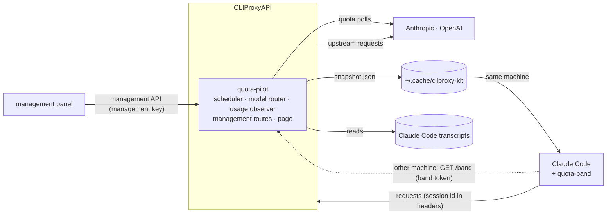

# How cliproxy-kit works

Three parts, one version, released together:

| Part | Folder | Language | Runs in |
| --- | --- | --- | --- |
| quota-pilot | `plugin/` | Go, built as a C shared library | CLIProxyAPI, through its plugin C ABI |
| quota-pilot page | `ui/` | React, built into one HTML file | the management panel, served by the plugin |
| quota-band | `mod/` | TypeScript | Claude Code, as a mod (function hooks) |

## quota-pilot

The plugin declares five capabilities: `scheduler` (across priorities), `model_router`,
`usage_plugin`, `request_interceptor` and `management_api`. It is the only place that chooses an
account and the only producer of quota data; the band and the page only read it.

### Choosing an account

Every pick that carries a Claude Code session id is answered with a concrete account, so the
native selector never moves a session; a pick without a session id is left to the native
selector. A session's account is bound per conversation thread and provider, and inherited by its
subagents. A new binding takes, in order:

1. the account the user switched the session to, when it is offered;
2. accounts with weekly quota left for the model and enough of their 5-hour window: at least
   `min_five_hour_left_percent` (25 by default) left, or a reset within 30 minutes. Among these the
   soonest weekly reset comes first, so quota that would expire unused is used first; a model with
   a weekly window of its own (Fable) goes by that window's reset;
3. accounts whose quota is not known yet;
4. accounts low on their 5-hour window, or used up.

Ties break by account id. A binding moves only after a success elsewhere: when its account stops
being offered (cooling down, removed, used up), not on a failed retry, a side request or a
subagent. It also moves when its session has been idle for an hour, so its prompt cache is gone
anyway, while its account is no longer one a new session would get: the next request goes to the
best account at no cost. A session the user switched stays. Bindings and routes live in
`state.json` for 24 hours after their last use, so a resumed session keeps its account and prompt
cache.

### Moving a session to another provider

`cross_provider: off` (the default) never changes provider: the band offers a one-press switch to
the model `fallback_map` names. `auto` moves a session only when every account of its provider is
used up on fresh data, never on unknown data, and only when the conversation fits the target
model's context (`context_lengths`, else a built-in table). A thread continuation sent to another
provider is answered `400 thread_unsupported_request`, which makes Claude Code resend the whole
conversation.

### Reading quota

Quota comes from the rate-limit headers of every response (Claude's `anthropic-ratelimit-unified-*`,
Codex's `x-codex-*`) and, for idle accounts, from each provider's usage endpoint every
`idle_poll_minutes`, using the account's own token through the host. Polling pauses after 15 minutes
without any request, because a plugin turned off in the config is never told, and resumes with the
next one; the page's Refresh reads every account at once. Within one window a reading only rises.
The last readings survive a restart in `state.json`, marked stale as they age.

### Where quota went

Every request is logged (`usage/YYYY-MM.jsonl`, three months) with its session, account, model
and tokens. Each rise of an account's weekly reading is shared among the requests since the
previous rise, weighted by tokens (output 5x, cache write 2x, cache read 0.1x) and model tier. A
rise no request explains, such as use on claude.ai or another tool, is reported as not matched to
a request; use from before the log began is reported apart and never split. A range is known only
from readings inside it, so an account without one shows as unknown, not as 0%.

Claude Code sessions are named from their transcripts (the user's rename, else Claude Code's
title, else the first request); a Codex session, whose records the proxy does not read, by its
first request: the folder in its environment context and what it asked. That folder is looked up on
the proxy's machine, so a Codex session from another machine counts under its folder's name unless
the same folder exists there. Sessions are placed in
projects by their repository: the nearest `.git`, `.jj` or `.hg`, with worktrees under their main
repository. A folder outside any repository is its own project. Codex counts only what goes through
the proxy, as Claude does, so Codex should be set up to use it (see the README).

### Files

All under `~/.cache/cliproxy-kit/` of the user the proxy runs as, mode 0600, so one proxy per user:

| File | What |
| --- | --- |
| `snapshot.json` | accounts, quota, sessions and routes, for the band (rewritten atomically) |
| `state.json` | bindings, routes and the last quota readings |
| `commands/` | the band's switch and route requests, applied once and acknowledged in the snapshot |
| `usage/` | the request log, recovered history, and the sessions named by their requests or by the band on another machine |

### Management routes and the page

Under `/v0/management/quota-pilot/`, behind the management key: `snapshot`, `usage`,
`usage/session` and `POST refresh`. Two resources, which CLIProxyAPI serves without
authentication: `/v0/resource/plugins/quota-pilot/ui`, the page (it carries no data and asks the
management routes for everything), and `/band`, the snapshot for a band on another machine, which
needs a key listed in `band_tokens` and carries opaque account ids.

## The page

One HTML file, built from `ui/` with the panel's own styles and components (MIT, see
`ui/LICENSE.panel`), embedded in the plugin. The panel lists it under Plugins and shows it in a
frame; only the panel's origin may frame it (`frame-ancestors 'self'`). It uses the management
key the panel saved when "remember password" was ticked, else one typed into the page and kept for
the tab; a refused key is not retried, since five wrong keys ban the address for 30 minutes. It
follows the panel's theme, language and width.

## quota-band

The band draws above the Claude Code prompt: tiles while Claude waits, one line while it works or
when the terminal is narrow, and one line also when another mod draws beneath it. It reads
`snapshot.json` when `ANTHROPIC_BASE_URL` is `localhost` or `127.0.0.1`; otherwise it reads
`/band` with `ANTHROPIC_AUTH_TOKEN` and sends the session's title, start folder and repository in
`X-Band-*` headers, so sessions on other machines are named in the usage report. Switching a
session's account or provider writes to `commands/`, so it is offered only on the machine that
runs the proxy; `compact` and `handoff` work everywhere.

## Upstream behaviour it relies on

Checked against CLIProxyAPI 8.0.16 and Claude Code 2.1.289:

- A scheduler plugin that handles a pick bypasses the native selector, session affinity included.
- Pick requests carry `canonical_session_id` (`claude:<session>`, with `:agent:<id>` for a
  subagent) and `parent_session_id`.
- Usage records arrive once per upstream attempt, failures included, with the rate-limit headers.
- Resources registered by a plugin are served under `/v0/resource/plugins/<id>/` without
  authentication; its management routes need the management key.
- A plugin library replaced in place is loaded again only when the proxy restarts.
- Claude Code sends its session id in `X-Claude-Code-Session-Id`, and continues server-side message
  threads; an expired thread is answered `404 thread_not_found`, which CLIProxyAPI 8.0.14 and later
  pass through so Claude Code replays the conversation.

## Limitations

- Crossing providers changes the model and rewrites the prompt cache; Claude Code does not know a
  non-Claude model's context size, so its auto-compact timing may be off.
- Remote Control, voice dictation and claude.ai connectors do not work through a proxy.
- The cache countdown is an estimate: the server's cache state cannot be observed.
- Sessions are named from transcripts on the machine that runs the proxy, so it must run as the
  same user as Claude Code there; other machines need the band.
- The plugin is trusted in-process code: a crash takes the proxy down with it.
